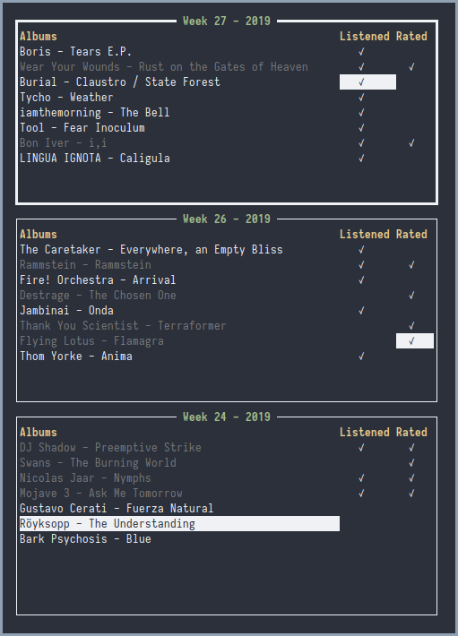

# Music Scheduler


A minimalistic command line scheduler for music aficionados.

## Required packages
* go
* git

## Installation
After installing the required packages, we need to clone the repository

```
git clcone https://github.com/Sacules/ms.git
```

Now we need to move into the repository and install the package

```
cd ms/
GOBIN=~/.local/bin/ go install
```

The GOBIN variable specifies where the binary will be placed. **Make sure it is in your PATH.**
